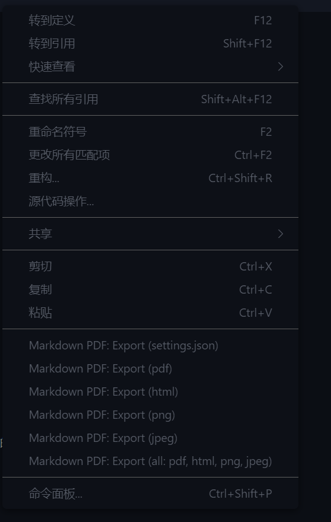

# Markdown 环境配置指北
markdown主流的编辑环境有vscode和typora。
## 1. Visual Studio Code (VSCode) 配置

### 1.1 安装 VSCode
- 下载地址: [Visual Studio Code 官方网站](https://code.visualstudio.com/)
- 根据你的操作系统选择适合的版本进行安装。

### 1.2 安装 Markdown 扩展
为了更好地支持 Markdown 编写，建议安装以下扩展：

- **Markdown All in One**: 提供了多种 Markdown 功能。
  - 安装方法:
    1. 打开 VSCode。
    2. 点击左侧侧边栏的扩展图标（或按 `Ctrl+Shift+X`）。
    3. 在搜索框中输入 `Markdown All in One`，找到后点击安装。
  
- **Markdown Preview Enhanced**: Markdown 预览工具。
  - 安装方法: 同上，搜索 `Markdown Preview Enhanced` 并安装。

- **Markdown PDF**:  Markdown 导出工具，帮助你将markdown导出为pdf,html,png,jpeg等格式的文件。
  - 安装方法: 同上，搜索 `Markdown PDF` 并安装。

### 1.3 预览
安装之后新建一个A.md文件，你可以在vscode的右上角找到打开`打开侧边预览`按钮，你就可以实时看到渲染效果啦！

### 1.4 导出（略微麻烦，也是使用vscode最大的缺点，如果你不想配置，可以参考下文的Typora配置，它的导出非常简单）
#### 下载Prince
- 进入[prince官网](https://www.princexml.com/download/)，点击电脑版本对应的链接进行下载并安装
- 下载完成并安装
- 选择右键我的电脑->属性->高级系统设置->环境变量->系统变量->Path->编辑
- 假设你的安装位置为X:\XX\Prince.那么请输入X:\XX\Prince\engine\bin，**然后连点三个确定（否则无法修改成功）**。

#### 导出方法
- 在配置完prince之后，重启vscode，在你的md文档中右击，你就可以找到Markdown PDF:Export的诸多选项，根据实际需要选择就可以啦！导出的文件会自动保存在当前文件夹下。

---

## 2. Typora 配置

### 2.1 安装 Typora
- 下载地址: [Typora 官方网站](https://typoraio.cn/)
- 按照提示完成安装。
- 然后你就配置好了（很简单吧）
### 2.2 Typora 主题设置
Typora 提供多种主题，可以根据个人喜好进行更改：
- 打开 Typora。
- 点击菜单栏的 `主题`，选择你喜欢的主题。
- 你可以通过点击 `自定义主题` 来导入或修改主题。

### 2.3 导出功能
Typora 提供便捷的导出功能，可以将文档导出为 PDF、HTML 等格式：
- 点击 `文件` -> `导出`，选择所需格式即可。

---

## 3. 总结
markdown的学习曲线非常平滑，可以说是最user-friendly的工具之一，相信你很快就能熟练掌握它并感受到它的便捷和强大。Markdown语法介绍可以参考[markdown语法](markdown_intro.md)这篇文章。

